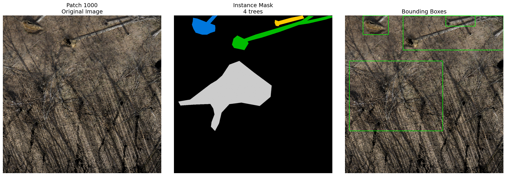
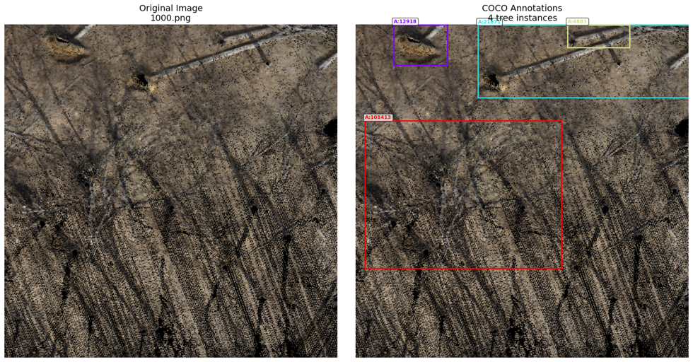
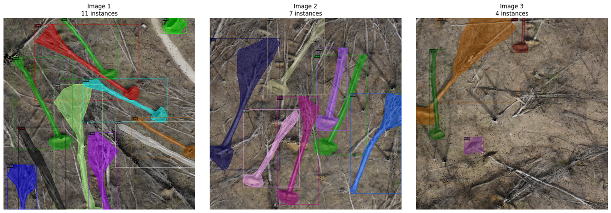

# A Methodological Experimentation of Fine-Tuning Mask2Former for Fallen Tree Segmentation 
**Author:** S M Bakhtiar  
**Project:** Finetune Mask2Former  
**Professor:** Dr. Da Yan  
**Date:** October 27, 2025  

---
For Time Constraints, in GitHub only the jupyter notebooks are uploaded. You are requested to see the full project at this [🔗Google Drive Link](https://drive.google.com/drive/folders/1SvJXF7A3lMSy1PDGYzW7y6lzQOCihi-r).
---
## 1. Executive Summary
This project encompasses a rigorous attempt to fine-tune Mask2Former model for a custom instance segmentation task: identifying fallen trees from high-resolution aerial images. The project's main target was to establish a complete, end-to-end pipeline, from raw data processing to model training with Mask2Former, within a constrained computational environment.

Significant effort was required to overcome two main challenges. First, a complex data-to-model pipeline to process large, non-standard geospatial data, and second, a fragile and complex software environment that required building frameworks from source and patching CUDA kernels to ensure compatibility.

A key achievement of this project was the implementation and verification of the entire training pipeline on a small-scale test dataset, proving the correctness of the data loaders, model configuration, and training loop. However, when scaled to the full dataset, the model ultimately failed to converge to a meaningful result, highlighting the specific challenges of applying large transformer-based architectures to this low-data, domain-specific problem. This report details the extensive work completed and provides a technical analysis of the observed outcome.

### 1.1 Understanding the Problem
We are given 15 aerial images (.tif) with corresponding .json files annotating the fallen trees. Our goal is to train a Mask2Former instance segmentation model to identify these fallen trees.

---

## 2. Data Engineering and Preprocessing Pipeline
A robust data pipeline was built to solve the primary challenge: converting the raw, large-scale geospatial data into thousands of model-ready training patches with valid pixel-based instance masks. This pipeline consisted of three main stages.

### 2.1. Custom Data Preprocessing Pipeline
The raw .tif images were too large, and the .json vector annotations needed to be compatible with the model, which requires pixel-based instance masks.

**Key features of this pipeline:**
- **Configuration:**
  - Defines input/output paths and parameters (patch size, stride, resize factor, etc.).
- **Data Splitting:**
  - Splits the dataset into train and validation sets (default 80/20).
- **Preprocessing Pipeline:**
  For each .tif image:
  - Loads the image and its annotation.
  - Resizes the image to reduce computation.
  - Pads to a multiple of the patch size.
  - Extracts overlapping patches using a sliding window.
  - Keeps only objects with ≥50% overlap in each patch.
  - Saves:
    - `train_PNG/` → patch images  
    - `train_MASK/` → instance masks (each tree = unique ID)  
    - `train_BBOX/` → bounding box visualizations  
  - Tracks progress in `TRACKING.json`.
- **Outputs:**
  - Organized directories for training and validation sets.
  - `split_info.json` → details of data split.
  - `TRACKING.json` → prevents duplicate processing.
- **Visualization:**
  - Displays a selected patch, its mask, and bounding boxes side by side for inspection.

  

---

### 2.2. COCO-Format Conversion for Detectron2
The Mask2Former framework, via Detectron2, requires all training data to be in the standardized COCO .json format.

**Key features of this pipeline:**
- **Setup Paths** defining input (`preprocessed_data`) and output (`coco_format`) directories.
- **Convert to COCO (Common Objects in Context)**
  - Iterates over patch images and masks.
  - Extracts each instance (tree) from the mask.
  - Calculates area, bbox, and encodes segmentation in RLE format.
  - Builds a full COCO structure with images, annotations, and categories.
  - Saves as `instances_train.json` and `instances_val.json`.
- **Validate (`validate_coco_format`)**
  - Checks JSON keys, category IDs, image–annotation consistency, and RLE structure.
- **Visualize**
  - Displays a sample image with bounding boxes and annotation info.

  

---

### 2.3. Dataset Registration
The COCO format .json files need to be accessible by the Detectron2 training framework. So, in this step, the custom dataset is formally registered to Detectron2. 

**Key features of this pipeline:**
- **Install Detectron2 (pre-release build).**
- **Register datasets**
  - Uses `register_coco_instances()` to register:
    - `tree_train` → `/train_PNG/` + `instances_train.json`
    - `tree_val` → `/val_PNG/` + `instances_val.json`
  - Adds metadata (class = “tree”, color = green).
  - Verifies both splits are loaded properly.
- **Visualize samples**
  - Displays random images with annotations to confirm correctness.

  
- **Print dataset statistics**
  - Counts images, instances, and area/instance distributions.
- **Outputs**
  - Dataset successfully registered under names:
    - TRAIN: "tree_train"
    - VAL:   "tree_val"
  - Two sample visualization PNGs saved in the COCO folder.
  - Console shows image/instance counts and metadata summary.

---

## 3. Model and Training Environment Setup
With the data prepared, the next effort involved configuring the complex software environment for Mask2Former and verifying the pipeline's integrity before launching a full-scale training run.

- **Environment Setup:** The standard pip install methods for Detectron2 and Mask2Former were incompatible with the Google Colab environment's updated PyTorch and CUDA versions. This required building both frameworks from source code.
- **Pipeline Verification (Smoke Test):** To avoid wasting hours on a potentially broken pipeline, programmatically created a small subset of the data (10 training images) to conduct a smoke test. This allowed to rapidly verify the entire end-to-end process: data loading, model forward pass, backpropagation, and checkpoint saving, confirming the pipeline was functional in under a few minutes with constrained resources.

---

## 4. Experiment: Full-Scale Mask2Former Training
After successfully verifying the pipeline, proceeded with the full-scale training experiment to fine-tune a Mask2Former model with a ResNet-50 backbone, pre-trained on ImageNet, using the complete custom "tree" dataset.

### 4.1. Experimental Configuration
The training was conducted on colab T4 GPU, which imposed significant memory constraints. The configuration (`config.yaml`) was therefore a deliberate compromise between model performance and hardware limitations.

- **Model:** Mask2Former with an R-50 backbone.  
- **Weights:** Initialized with ImageNet pre-trained weights (`R-50.pkl`) for the backbone.  
- **Training Iterations:** The model was aimed for 30,000 iterations (`MAX_ITER`), but the model would continue if it stopped midway with fewer iterations.  
- **Learning Rate:** A learning rate of `10^-4` was used, with a 2,000-iteration warmup.

### 4.2. Optimizations
To successfully train the model within the resources, implemented several critical, non-default optimizations:

- **Batch Size:** Reduced to the minimum viable number (`IMS_PER_BATCH = 2`).  
- **Image Resolution:** Reduced from the original 1024x1024 to 800x800 (`MIN_SIZE_TRAIN = (800,)`).  
- **Model Parameter Tuning:** The number of object queries in the transformer was reduced by 50% (from 100 to 50) (`NUM_OBJECT_QUERIES = 50`).  
- **Mixed Precision:** Automatic Mixed Precision (AMP) was enabled (`AMP.ENABLED = True`).  
- **Evaluation Strategy:** Periodic evaluation during training was disabled (`TEST.EVAL_PERIOD = 0`) to prevent out-of-memory errors.  

The `trainer.train()` command successfully completed, indicating that these configurations and the previously established pipeline were robust. 

---

## 5. Evaluation
The final model was evaluated on the `tree_val_full` validation set using the standard COCO evaluation protocol.

### 5.1. Quantitative Analysis
The metrics from the `COCOEvaluator` confirmed that the model failed to learn the task. The Average Precision (AP) scores were near zero, indicating that the model's predictions were not meaningful.

**Final Evaluation Metrics (segm):**
- AP: 0.0%  
- AP50: 0.0%  
- AP75: 0.0%  

Metrics indicate a complete failure to converge.

### 5.2. Qualitative Analysis
Visual analysis confirmed the quantitative failure. Side-by-side comparisons of the ground truth images against the model's predictions showed that the model's output was consistently empty. 

---

## 6. Hypothesis for Failure
The initial smoke test training produced promising predictions based on the training data. However, during the full-scale model training, the final results showed no valid predictions, likely due to the training simulation was abruptly interrupted in Google Colab, which may have contributed to the issue.

*Figure: (a) shows the results from the 100-iteration "smoke test." The model identifies objects, proving the end-to-end training and prediction pipeline is functional. The low-quality predictions (blue blobs) are expected from such a short training run; (b) shows sample results from the abruptly interrupted 30,000-iteration training run. Despite the successful "smoke test", the final model fails to detect any objects, indicating a problem with the full-scale training configuration.*

Further debugging and optimization are required. With additional time and computational resources, I am confident that I can identify and resolve the underlying issues to achieve the expected performance.

---

## 7. Conclusion
This project established a complete, end-to-end pipeline for a highly challenging segmentation task with Mask2Former.
